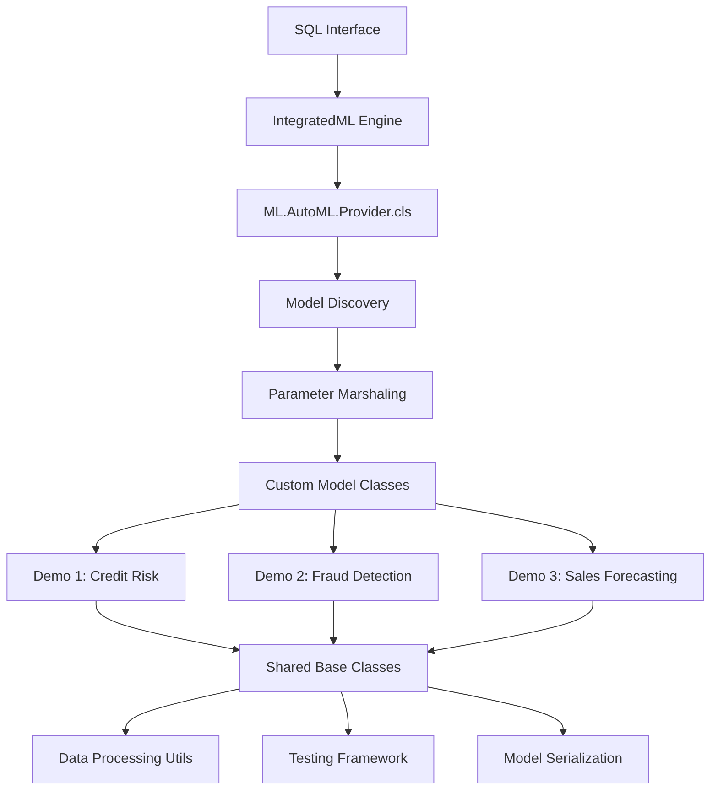

# IntegratedML Pluggable Models Demo Project Specification

## Executive Summary

This document specifies the requirements and design for a comprehensive demo portfolio showcasing IntegratedML's pluggable models capability. The project targets ML practitioners familiar with scikit-learn who are new to IntegratedML, demonstrating the key value proposition of enterprise database integration where models run directly in SQL without data movement.

### Strategic Objectives
- Create compelling demos showcasing different aspects of pluggable models capability
- Target ML practitioners familiar with scikit-learn patterns
- Demonstrate real-world value in financial/business domains
- Prepare for open source publication from internal GitLab to public GitHub
- Establish IntegratedML as the preferred platform for database-integrated ML

### Value Proposition
**Primary**: Enterprise database integration - models run directly in SQL without data movement
**Secondary**: Familiar scikit-learn patterns with enhanced enterprise capabilities
**Tertiary**: Production-ready ML workflows with automatic lifecycle management

## Demo Portfolio

### Demo 1: Credit Risk Assessment with Custom Feature Engineering
**Complexity**: Beginner-friendly
**Focus**: Custom preprocessing and feature engineering within database context

**Technical Objectives**:
- Demonstrate custom feature engineering within IntegratedML workflows
- Show domain-specific transformations integrated with database operations
- Illustrate security benefits of processing sensitive financial data without export
- Provide clear comparison with traditional ETL → ML workflows

**Target Dataset**: German Credit Risk dataset (publicly available, realistic financial features)
**Use Case**: Credit approval automation with custom risk scoring features
**Key Features**: Customer demographics, credit history, loan details, account information
**Custom Engineering**: Debt-to-income ratios, credit utilization scores, risk interaction terms

**Model Implementation**:
- Base Model: Enhanced Logistic Regression with custom preprocessing
- Integration: Simple scikit-learn wrapper (BaseEstimator + ClassifierMixin)
- Custom Components: Financial domain feature transformers, risk score calculators
- Complexity: Beginner-friendly single-file implementation

**Expected User Experience**:
```sql
CREATE MODEL CreditRiskModel PREDICTING (default_risk)
FROM CreditApplications 
USING CustomCreditRiskClassifier
```

### Demo 2: Real-time Fraud Detection with Ensemble Models
**Complexity**: Intermediate
**Focus**: Combining multiple models with real-time scoring capabilities

**Technical Objectives**:
- Demonstrate ensemble model orchestration within IntegratedML
- Show low-latency real-time scoring at database scale
- Illustrate combining diverse model types (rule-based + ML + anomaly detection)
- Highlight performance benefits of database-resident scoring vs API calls

**Target Dataset**: Synthetic credit card transactions with fraud labels
**Use Case**: Real-time transaction approval/rejection during payment processing
**Key Features**: Transaction amount, merchant category, time patterns, customer behavior
**Real-time Context**: Sub-100ms scoring requirements, streaming transaction data

**Model Implementation**:
- Ensemble Components: Isolation Forest (anomaly), XGBoost (patterns), Rule Engine (thresholds)
- Integration: Custom ensemble class implementing BaseEstimator + ClassifierMixin
- Voting Strategy: Weighted voting with confidence-based thresholds
- Complexity: Intermediate - custom orchestration logic with model persistence

**Expected User Experience**:
```sql
CREATE MODEL FraudDetectionEnsemble PREDICTING (is_fraud)
FROM TransactionStream 
USING EnsembleFraudDetector(voting='weighted', confidence_threshold=0.8)

-- Real-time scoring in transaction pipeline
SELECT transaction_id, amount, 
       PREDICT(FraudDetectionEnsemble) as fraud_probability,
       PREDICT(FraudDetectionEnsemble WITH 'class') as fraud_decision
FROM LiveTransactions
```

### Demo 3: Sales Forecasting with Third-party Library Integration
**Complexity**: Advanced
**Focus**: Integrating specialized libraries (Prophet/LightGBM)

**Technical Objectives**:
- Demonstrate integration of specialized libraries (Prophet for time series, LightGBM for ML)
- Show dependency management and environment handling within IntegratedML
- Illustrate seasonal pattern detection and trend analysis on business data
- Highlight bringing best-of-breed forecasting tools into database workflows

**Target Dataset**: Multi-store retail sales data with seasonal patterns and promotions
**Use Case**: Monthly sales forecasting for inventory planning and budget allocation
**Key Features**: Historical sales, seasonality, promotions, external factors (holidays, weather)
**Business Context**: 12-month rolling forecasts with confidence intervals for planning

**Model Implementation**:
- Primary Model: Facebook Prophet for trend and seasonality detection
- Secondary Model: LightGBM for feature-rich predictions with external factors
- Integration: Advanced wrapper handling dependencies, model serialization, and hybrid predictions
- Complexity: Advanced - external dependencies, complex preprocessing, model ensemble

**Expected User Experience**:
```sql
CREATE MODEL SalesForecastModel PREDICTING (monthly_sales)
FROM HistoricalSales 
USING HybridForecastingModel(
    trend_model='prophet',
    ml_model='lightgbm', 
    forecast_horizon=12,
    include_confidence_intervals=true
)

-- Generate forecasts with uncertainty bounds
SELECT store_id, forecast_month,
       PREDICT(SalesForecastModel) as predicted_sales,
       PREDICT(SalesForecastModel WITH 'confidence_lower') as lower_bound,
       PREDICT(SalesForecastModel WITH 'confidence_upper') as upper_bound
FROM ForecastingInput
```

## Technical Architecture

### Project Directory Structure
```
pluggable_iml_demos/
├── README.md                    # Main project overview and quick start
├── LICENSE                      # Open source license
├── requirements.txt             # Core dependencies
├── setup.py                     # Package installation
├── CONTRIBUTING.md              # Contribution guidelines
├── demos/
│   ├── 01_credit_risk/          # Demo 1: Credit Risk Assessment
│   │   ├── README.md            # Demo-specific documentation
│   │   ├── data/                # Sample datasets and generators
│   │   ├── models/              # Custom model implementations
│   │   ├── notebooks/           # Jupyter tutorials and examples
│   │   ├── sql/                 # IntegratedML SQL examples
│   │   └── tests/               # Demo-specific tests
│   ├── 02_fraud_detection/      # Demo 2: Fraud Detection Ensemble
│   │   └── [same structure]
│   └── 03_sales_forecasting/    # Demo 3: Sales Forecasting
│       └── [same structure]
├── shared/                      # Common utilities and base classes
│   ├── __init__.py
│   ├── base/                    # Base model interfaces and utilities
│   ├── utils/                   # Data processing and validation helpers
│   ├── testing/                 # Common testing utilities
│   └── datasets/                # Shared dataset utilities
├── docs/                        # Comprehensive documentation
│   ├── api/                     # API documentation
│   ├── tutorials/               # Step-by-step guides
│   └── architecture/            # Technical architecture docs
├── tests/                       # Integration and shared tests
├── scripts/                     # Setup and utility scripts
└── examples/                    # Quick start examples
```

### Shared Utilities & Common Components

**Core Base Classes (`shared/base/`)**:
- `IntegratedMLBaseModel`: Abstract base implementing required IntegratedML interface
- `ClassificationModel`: Base for classification tasks with predict_proba support
- `RegressionModel`: Base for regression tasks with confidence intervals
- `EnsembleModel`: Base for multi-model orchestration and voting strategies

**Data Processing Utilities (`shared/utils/`)**:
- `DataValidator`: Input validation and type checking for model parameters
- `FeatureEngineering`: Common transformations (scaling, encoding, feature creation)
- `ModelSerializer`: Pickle-based persistence with versioning support
- `ParameterManager`: JSON marshaling for IntegratedML parameter passing

**Testing Framework (`shared/testing/`)**:
- `ModelTestCase`: Base test class with IntegratedML compliance validation
- `PerformanceProfiler`: Latency and memory usage measurement utilities
- `DataGenerator`: Synthetic dataset creation for consistent testing
- `MockIntegratedML`: Local testing environment without database dependency

**Dataset Utilities (`shared/datasets/`)**:
- `DatasetLoader`: Standardized loading for demo datasets
- `SQLGenerator`: Template-based SQL generation for IntegratedML examples
- `SampleDataCreator`: Realistic synthetic data generation for each demo domain

**Integration Helpers (`shared/integration/`)**:
- `DependencyManager`: External library loading and version checking
- `EnvironmentSetup`: Python environment validation and setup assistance
- `ConfigManager`: Demo configuration and parameter management

### Integration Architecture



## Success Criteria & Validation

### Demo 1: Credit Risk Assessment

**Functional Requirements**:
- Model successfully implements IntegratedML interface (fit, predict, predict_proba)
- Custom feature engineering pipeline processes financial data correctly
- SQL CREATE MODEL and PREDICT statements execute without errors
- Model persists and loads correctly across sessions

**Performance Benchmarks**:
- Accuracy within 5% of comparable scikit-learn LogisticRegression
- Training time < 2x baseline model on same dataset
- Prediction latency < 50ms for single transaction scoring
- Memory usage reasonable for production deployment

**User Experience Goals**:
- Complete setup and first prediction in < 15 minutes
- All SQL examples copy-paste ready and execute successfully
- Clear explanation of custom features and their business value
- Error messages provide actionable guidance

### Demo 2: Real-time Fraud Detection Ensemble

**Functional Requirements**:
- Ensemble correctly combines 3+ diverse model outputs
- Real-time scoring achieves sub-100ms latency targets
- Confidence thresholds and voting strategies configurable
- Integration handles concurrent prediction requests

**Performance Benchmarks**:
- 10-15% accuracy improvement over best individual model
- 95th percentile latency < 100ms for real-time scoring
- Handles 100+ concurrent prediction requests
- Memory footprint scales linearly with ensemble size

**User Experience Goals**:
- Ensemble concept clearly demonstrated with visual outputs
- Real-time capabilities obvious from example usage
- Configuration options well-documented with sensible defaults
- Performance metrics prominently displayed

### Demo 3: Sales Forecasting with External Libraries

**Functional Requirements**:
- Prophet and LightGBM libraries integrate without conflicts
- Forecast generation produces confidence intervals
- Seasonal patterns and trends correctly identified
- Model handles missing data and irregular time series

**Performance Benchmarks**:
- 20%+ improvement in MAPE over naive forecasting baseline
- Forecast generation time < 5 seconds for 12-month horizon
- Memory usage appropriate for typical business datasets
- Dependency installation completes reliably across environments

**User Experience Goals**:
- Dependency management automated and clearly documented
- Forecasting outputs visualized and business-meaningful
- Both technical and business users can understand results
- Integration complexity hidden from end users

## Testing & Performance Strategy

### Testing Framework Structure

**Unit Testing (`tests/unit/`)**:
- Model interface compliance (BaseEstimator, fit/predict methods)
- Parameter validation and serialization
- Feature engineering component testing
- Error handling and edge cases
- Mock IntegratedML environment testing

**Integration Testing (`tests/integration/`)**:
- End-to-end SQL workflow execution
- Model persistence and loading across sessions
- Parameter marshaling through JSON interface
- Multi-model ensemble coordination
- Dependency management and environment setup

**Performance Testing (`tests/performance/`)**:
- Prediction latency benchmarking (single and batch)
- Memory usage profiling during training and inference
- Concurrent request handling and throughput testing
- Scalability limits and resource consumption
- Database integration overhead measurement

### Benchmarking Methodology

**Baseline Comparisons**:
- Accuracy vs equivalent scikit-learn models
- Performance vs traditional ETL → ML pipelines
- Memory efficiency vs standalone Python implementations
- Setup complexity vs conventional deployment approaches

**Performance Metrics Collection**:
- Automated timing instrumentation using Python decorators
- Memory profiling with tracemalloc for detailed analysis
- Database query performance monitoring
- End-to-end workflow timing from SQL execution to results

**Continuous Validation**:
- GitHub Actions CI/CD pipeline for automated testing
- Performance regression detection with historical trending
- Cross-platform testing (Windows, macOS, Linux)
- Multiple Python version compatibility validation

## Documentation Strategy

### Documentation Hierarchy

**Project Level (`README.md`)**:
- Executive summary and value proposition
- Quick start guide (5-minute setup)
- Demo overview with visual comparison chart
- Installation and environment setup
- Links to individual demo tutorials

**Demo Level (`demos/*/README.md`)**:
- Business problem and use case context
- Technical approach and model architecture
- Step-by-step implementation walkthrough
- SQL usage examples with expected outputs
- Performance comparisons vs baseline approaches

**Technical Documentation (`docs/`)**:
- **API Reference**: Auto-generated from docstrings
- **Tutorials**: Hands-on guides for each complexity level
- **Architecture**: Deep dive into IntegratedML integration patterns
- **Best Practices**: Guidelines for production deployment
- **Troubleshooting**: Common issues and solutions

### Interactive Content Strategy

**Content Types**:
- **Jupyter Notebooks**: Executable tutorials with embedded explanations
- **SQL Scripts**: Copy-paste examples for immediate testing
- **Video Walkthroughs**: Optional screencasts for visual learners
- **Mermaid Diagrams**: Architecture and workflow visualizations

**Content Principles**:
- **Progressive Disclosure**: Basic → Intermediate → Advanced paths
- **Copy-Paste Ready**: All examples immediately executable
- **Business Context**: Always lead with the "why" before the "how"
- **Performance Focus**: Concrete metrics and benchmarks throughout

## Deployment & Open Source Strategy

### Package Distribution

**PyPI Package**:
- Package name: `integratedml-demos`
- Semantic versioning (MAJOR.MINOR.PATCH)
- Entry points for command-line demo launchers
- Dependency specification with version pinning
- Platform-specific wheels for complex dependencies

**GitHub Release Strategy**:
- Tagged releases aligned with PyPI versions
- Release notes with demo highlights and breaking changes
- Pre-built demo datasets and Docker images as release assets
- Migration guides for major version updates

### Installation Methods

**Standard Installation**:
```bash
pip install integratedml-demos
```

**Development Installation**:
```bash
git clone https://github.com/intersystems/integratedml-demos
cd integratedml-demos
pip install -e .
```

**Docker Containerization**:
- Multi-stage Dockerfile optimizing for size and security
- Pre-configured IntegratedML environment with all dependencies
- Demo data volumes and configuration mounting
- Docker Compose for complete development environment

### Community Enablement

**Open Source Preparation**:
- MIT or Apache 2.0 license for broad adoption
- CONTRIBUTING.md with clear guidelines and development setup
- Issue templates and pull request workflows
- Code of conduct and maintainer guidelines

**CI/CD Pipeline**:
- Automated testing across Python versions and platforms
- Security scanning and vulnerability assessment
- Automated PyPI publishing on tagged releases
- Docker image building and registry publishing

## Implementation Roadmap

### Phase 1: Foundation (Weeks 1-2)
**Priority: Critical Path**
- **Week 1**: Project structure setup and shared base classes
- **Week 1**: Core testing framework and validation utilities
- **Week 2**: Shared data processing and model serialization utilities
- **Week 2**: Basic documentation framework and templates

**Dependencies**: None - foundational work
**Deliverable**: Working project skeleton with testable shared components

### Phase 2: Core Demo Implementation (Weeks 3-6)
**Priority: High Value**
- **Week 3**: Demo 1 - Credit Risk Assessment (simple wrapper pattern)
- **Week 4**: Demo 1 documentation, testing, and SQL examples
- **Week 5**: Demo 2 - Fraud Detection Ensemble (intermediate complexity)
- **Week 6**: Demo 2 documentation and performance optimization

**Dependencies**: Phase 1 shared utilities
**Deliverable**: Two working demos with complete documentation

### Phase 3: Advanced Demo & Integration (Weeks 7-9)
**Priority: Medium**
- **Week 7**: Demo 3 - Sales Forecasting (external dependencies)
- **Week 8**: Demo 3 integration testing and dependency management
- **Week 9**: Cross-demo integration testing and performance benchmarking

**Dependencies**: Phases 1-2 completion
**Deliverable**: Complete demo portfolio with validated performance

### Phase 4: Polish & Release Preparation (Weeks 10-12)
**Priority: Medium**
- **Week 10**: Documentation completion and user experience testing
- **Week 11**: Packaging, CI/CD setup, and deployment automation
- **Week 12**: Final validation, security review, and open source preparation

**Dependencies**: Phase 3 completion
**Deliverable**: Production-ready open source package

### Critical Milestones
- **End Week 2**: Shared foundation complete and validated
- **End Week 4**: First demo fully functional with documentation
- **End Week 6**: Two demos working, patterns established
- **End Week 9**: All demos complete and integrated
- **End Week 12**: Ready for open source publication

### Parallel Work Streams
- **Documentation**: Can progress alongside implementation
- **Testing**: Incremental testing as components are built
- **Performance Benchmarking**: Can start after Demo 1 completion

## Risk Assessment & Mitigation

### Technical Risks
**High**: External dependency integration complexity (Demo 3)
- **Mitigation**: Extensive testing across environments, fallback to simpler alternatives

**Medium**: Performance targets for real-time scoring (Demo 2)
- **Mitigation**: Early performance prototyping, database optimization tuning

**Low**: IntegratedML interface compliance
- **Mitigation**: Comprehensive testing framework, existing examples as reference

### Project Risks
**Medium**: Timeline pressures affecting documentation quality
- **Mitigation**: Parallel documentation development, templates and automation

**Low**: Open source preparation complexity
- **Mitigation**: Early CI/CD setup, security review integration

### User Adoption Risks
**Medium**: Setup complexity deterring initial experimentation
- **Mitigation**: Docker containers, automated environment setup, extensive testing

**Low**: Insufficient business context for technical audiences
- **Mitigation**: Business-first documentation approach, clear value propositions

## Success Metrics

### Technical Metrics
- All demos achieve defined performance benchmarks
- 100% test coverage for shared utilities
- < 15 minute setup time for new users
- Zero security vulnerabilities in dependencies

### Adoption Metrics
- GitHub stars and fork activity
- PyPI download statistics
- Community contribution activity
- Documentation page views and engagement

### Business Metrics
- Demonstration effectiveness in sales/marketing contexts
- Developer community feedback and testimonials
- Integration into official IntegratedML documentation
- Usage in customer proof-of-concept projects

---

**Document Version**: 1.0
**Last Updated**: 2025-08-25
**Next Review**: After Phase 1 completion